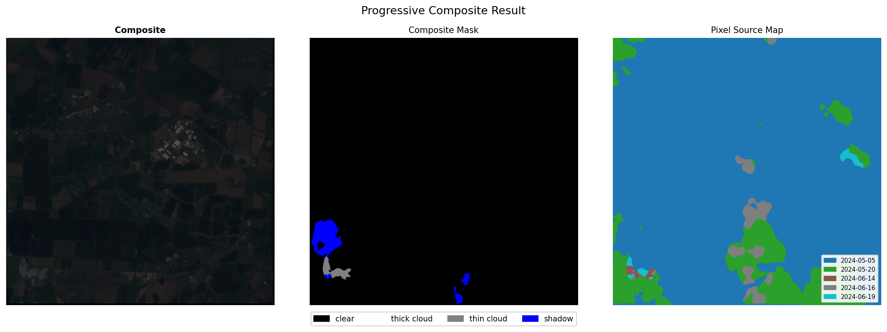

# Sentinel-2 Cloud Segmentation and Removal

[](https://www.python.org/)
[](https://pytorch.org/)
[](https://cloudsen12.github.io/)
[](LICENSE)

End-to-end pipeline for cloud detection and removal from Sentinel-2 L1C imagery. The model segments clouds across multiple acquisitions of the same location and composites a cloud-free result.


---

## Model

UNet++ with ResNet34 encoder trained on the high-quality subset of [CloudSen12](https://cloudsen12.github.io/) (~10k patches, 7-band L1C Sentinel-2, 512x512 px (padded from 509x509 px) at 10m resolution).

Four output classes: **clear · thick cloud · thin cloud · cloud shadow** gave the best validation result on 10'th epoch. See [`learning.ipynb`](learning.ipynb) for any learning pipeline details.

| Class | IoU | Dice |
|---|---|---|
| Clear | 0.903 | 0.949 |
| Thick cloud | 0.836 | 0.911 |
| Thin cloud | 0.612 | 0.759 |
| Shadow | 0.625 | 0.769 |
| **Mean** | **0.719** | **0.830** |

---

## Compositing

Cloud-free images are reconstructed from N scenes via progressive pixel replacement:

```
thick cloud  →  thin cloud  →  shadow  →  clear
```

Each pixel is sourced from the least-cloudy available scene at that location.



---

## Usage

CDSE credentials are required for scene fetching. Generate S3 keys at [eodata-s3keysmanager.dataspace.copernicus.eu](https://eodata-s3keysmanager.dataspace.copernicus.eu/panel/s3-credentials), setup os.environ or save to `.env`:

```
AWS_ACCESS_KEY_ID=your_key
AWS_SECRET_ACCESS_KEY=your_secret
```

See [`demo.ipynb`](demo.ipynb) for a full walkthrough.

---

## Project structure

```
src/
  download.py    extract CloudSen12 training data
  datasets.py    CloudDataset (training), CustomSceneDataset (inference)
  fetching.py    fetch Sentinel-2 scenes from CDSE STAC API
  models.py      UNetPlusPlusResNet34, CosineAnnealingWarmRestartsDecay
  inference.py   get_predictions(), composite()
  viz.py         show_images(), show_predictions(), show_confidence(), show_composite_source()
weights/
  UNetPlusPlus.pt
demo.ipynb
learning.ipynb
```

---

## Requirements

```
torch>=2.0
segmentation-models-pytorch
rasterio
odc-stac
pystac-client
torchvision
torchmetrics
accelerate
python-dotenv
```
